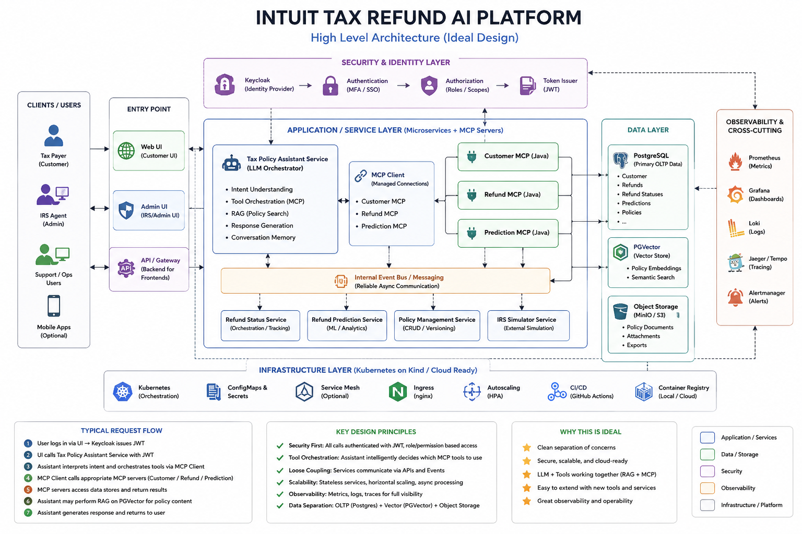
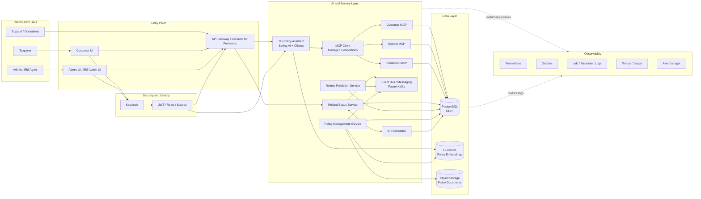

# Intuit Tax Refund AI Platform

## Current Version

**v0.5.7.4**

## Overview

A cloud-native tax refund platform inspired by TurboTax-style customer experiences.

The platform demonstrates:

- secure customer and admin authentication with Keycloak and JWT
- tax return and refund tracking
- refund status synchronization with an IRS simulator
- refund ETA prediction
- refund history and lifecycle timelines
- PostgreSQL-backed transactional and simulator data
- a Spring AI assistant using Ollama, MCP tools, RAG, and PGVector
- interchangeable Java and Python MCP server runtimes
- separate customer, simulator, administration, and operations interfaces
- Docker, Kubernetes, Kind, and Kustomize deployment
- an architecture designed for observability, event-driven integration, and future cloud scaling

This project is intended for system-design interviews, AI architecture discussions, integration testing, and local demonstrations. It is not connected to the real IRS and must not be used with real taxpayer data.

---

## Version Highlights

### v0.5.7.4 — Unified AI Tool and MCP Foundation

- Customer UI sends the Keycloak bearer token to the assistant API
- Per-user chat history and conversation IDs in the browser
- Java and Python MCP server implementations
- Stable MCP service endpoints with runtime switching
- Customer, refund, refund-history, and prediction tools
- Refund and prediction SQL aligned to the current PostgreSQL schema
- Spring AI MCP client integration and tool discovery
- PGVector policy search exposed as an AI tool
- Version-independent Docker JAR packaging

### v0.5.7.0–v0.5.7.3 — MCP and Orchestration Foundation

- MCP server project organization for Java and Python
- Spring AI MCP client connectivity
- Internal tool registry abstraction
- Intent classification and orchestration planning foundation

### v0.5.5 — Admin Portal

- Standalone `admin-ui`
- Standalone `admin-service`
- Keycloak login
- `ADMIN` realm-role enforcement
- Dashboard totals
- Refund counts by status
- Read-only customer search
- Read-only refund search
- Policy and system navigation placeholders

### v0.5.4 — IRS Simulator Console

- Standalone `irs-admin-ui`
- PostgreSQL-backed `irs-simulator`
- Create, list, retrieve, update, and delete simulator records
- Local-only simulator console
- Customer refresh synchronization

### v0.5.3 — Refund Timeline and History

- Refund lifecycle timeline
- PostgreSQL refund-history table and trigger
- Customer-visible recent activity
- Improved prediction and empty states

### v0.5.2 — Filed Return Workflow

- Filed-return creation
- Support for newly registered customers
- External refund reference
- Filing method
- Customer dashboard integration

### v0.5.1 — Registration and Profile

- Customer self-registration through Keycloak
- Customer profile page
- Application user synchronization
- Profile update API

---

## Major Features

### Customer Experience

- Keycloak login and registration
- Customer profile management
- Add a filed tax return
- View latest refund status
- View refund amount and tax year
- Refresh status from the IRS simulator
- View refund lifecycle timeline
- View refund status history
- View predicted refund date and confidence
- Ask refund-policy questions through a floating AI chatbot

### IRS Simulator

- Persistent PostgreSQL simulator records
- Create demo refund records
- Search and list records
- Advance simulated IRS status
- Set an official refund date
- Delete simulator records
- Preserve external-system separation from customer refund tables

### Admin Portal

- Keycloak-protected admin login
- `ADMIN` role authorization
- Platform dashboard metrics
- Registered-user search
- Refund search
- Refund counts by status
- Full policy management
- System-operations placeholder

### AI and RAG

- Spring AI integration
- Ollama local LLM support
- PGVector embeddings and retrieval
- Tax-policy document ingestion (PDF, DOCX, TXT)
- Policy-grounded chatbot responses
- Refund ETA prediction service

---

## High-Level Architecture



The final design separates user-facing applications, identity, AI orchestration, MCP tools, business services, data stores, infrastructure, and observability. The current Kind deployment implements the core path, while the diagram also shows the intended production-ready direction.



### Layer Responsibilities

| Layer | Responsibilities |
|---|---|
| Clients and entry point | Customer, admin, IRS simulator, support, and optional mobile experiences; routing through an API gateway or backend-for-frontend layer |
| Security and identity | Keycloak authentication, JWT issuance, roles, scopes, and service authorization |
| Tax Policy Assistant | Intent understanding, tool orchestration, RAG policy search, response generation, and future conversation memory |
| MCP layer | Standardized access to customer, refund, history, and prediction capabilities; Java/Python runtime interchangeability |
| Business services | Refund tracking, prediction, policy management, administration, and IRS simulation |
| Data | PostgreSQL OLTP tables, PGVector embeddings, and future object storage for source documents |
| Platform | Kubernetes, ConfigMaps and Secrets, ingress, autoscaling, CI/CD, and container registry |
| Observability | Metrics, logs, traces, dashboards, alerting, SLOs, and operational runbooks |

### Key Architectural Principles

- **Security first:** browser requests carry Keycloak JWTs; internal tools must derive trusted identity from authenticated context rather than user-entered identifiers.
- **Tool-based AI integration:** the assistant uses MCP tools for account data and PGVector-backed policy search for policy knowledge.
- **Separation of concerns:** user interfaces, orchestration, MCP adapters, business services, and persistence are independently deployable.
- **Runtime flexibility:** stable Kubernetes services can route to either Java or Python MCP implementations.
- **Loose coupling:** synchronous APIs support direct user requests; a future Kafka event bus handles durable asynchronous workflows.
- **Data separation:** transactional data remains in PostgreSQL, semantic retrieval uses PGVector, and source files can move to object storage.
- **Operational readiness:** every service should expose health, metrics, structured logs, traces, and safe diagnostic information.

---

## Core Workflows

### Customer Refund Refresh

```text
Customer
  -> customer-ui
  -> refund-status-service
  -> irs-simulator
  -> irs_refund_records
  -> refund-status-service
  -> refund_statuses
  -> refund_status_history
  -> customer dashboard
```

### IRS Simulation

```text
Demo operator
  -> irs-admin-ui
  -> irs-simulator
  -> irs_refund_records
```

The IRS Simulator represents external state. The customer application does not write directly to `irs_refund_records`.

### Admin Operations

```text
Admin user
  -> admin-ui
  -> Keycloak
  -> JWT with ADMIN role
  -> admin-service
  -> PostgreSQL read models
```

### AI Refund Assistant

```text
Customer
  -> customer-ui
  -> Keycloak login and JWT
  -> tax-policy-assistant-service
  -> Spring AI tool-calling loop
       -> Customer MCP for customer context
       -> Refund MCP for latest status and history
       -> Prediction MCP for an expected refund date
       -> search_tax_policy for PGVector policy retrieval
  -> Ollama generates one grounded response
  -> customer-ui displays the answer and sources
```

The trusted customer identity should be derived from the authenticated security context. It should not be requested from the user, logged in plaintext, or unnecessarily included in model prompts.

---

## Repository Structure

```text
applications/
  customer-ui/
  irs-admin-ui/
  admin-ui/

services/
  core/
    refund-status-service/
  integrations/
    irs-simulator/
  admin/
    admin-service/
  ai/
    refund-prediction-service/
    tax-policy-assistant-service/
    mcp/
      java/
        customer-mcp-server/
        refund-mcp-server/
        prediction-mcp-server/
      python/
        customer-mcp-server/
        refund-mcp-server/
        prediction-mcp-server/

infrastructure/
  keycloak/
  kubernetes/
    base/
    overlays/
    jobs/

scripts/

docs/
  01-architecture/
  04-kubernetes/
  05-database/
  05-security/
  06-testing/
  07-release-notes/
```

Some service directories may differ slightly depending on the local repository layout.

---

## Technology Stack

### Frontend

- React
- Vite
- Keycloak JavaScript adapter
- Nginx

### Backend

- Java 21
- Spring Boot 4
- Spring Security
- OAuth2 Resource Server
- Spring JDBC
- Spring AI

### Data and AI

- PostgreSQL
- PGVector
- Redis for planned or optional chat memory
- Ollama
- Local embedding models
- Refund prediction service

### Infrastructure

- Docker
- Kubernetes
- Kind
- Kustomize
- PowerShell

---

## Service and UI Ports

| Component | Local Port | Purpose |
|---|---:|---|
| Customer UI | 3000 | Customer refund experience |
| IRS Simulator Console | 3100 | Local simulator operations |
| Admin UI | 3200 | Secured operations portal |
| Admin Service | 8050 | Admin APIs |
| Customer MCP | 8030 | Customer account tools |
| Refund MCP | 8031 | Latest refund and history tools |
| Prediction MCP | 8032 | Deterministic refund-date prediction tool |
| Policy Management Service | 8040 | Policy administration APIs |
| Tax Policy Assistant Service | 8060 | RAG and policy chatbot |
| Refund Prediction Service | 8070 | Refund ETA prediction |
| Refund Status Service | 8080 | Customer refund APIs |
| Keycloak | 8081 | Authentication and authorization |
| IRS Simulator | 8090 | Simulated external IRS API |
| PostgreSQL | 5432 | Transactional data and PGVector |
| Redis | 6379 | Optional chat/session memory |
| Ollama | 11434 | Local LLM and embeddings |

Kubernetes services can reuse the same internal service port because each has its own ClusterIP. Local port-forward ports must be unique.

---

## Current Image Versions

| Image | Version |
|---|---|
| customer-ui | 0.5.7.4 |
| tax-policy-assistant-service | 0.5.7.4 |
| refund-mcp-server (Java) | 0.5.7.4 |
| prediction-mcp-server (Java) | 0.5.7.4 |
| customer-mcp-java | 0.5.7.0 |
| customer-mcp-python | 0.5.7.0 |
| refund-mcp-python | 0.5.7.0 |
| prediction-mcp-python | 0.5.7.0 |
| refund-status-service | 0.5.3 |
| irs-admin-ui | 0.5.4 |
| irs-simulator | 0.5.4 |
| admin-ui | 0.5.6 |
| admin-service | 0.5.5 |
| policy-management-service | 0.5.6 |
| refund-prediction-service | 0.4.2 |

Update this table whenever a component is rebuilt with a newer image tag.

---

## Prerequisites

- Windows PowerShell
- Java 21+
- Maven 3.9+
- Docker Desktop
- Kind
- kubectl
- Ollama
- Git

Optional:

- IntelliJ IDEA
- Postman
- pgAdmin

---

## Ollama Setup

```powershell
ollama pull llama3.2
ollama pull nomic-embed-text
ollama list
```

Use the models configured in the Tax Policy Assistant service.

---

## Keycloak Setup

The platform uses Keycloak for authentication and role-based authorization.

Realm:

```text
refund-platform
```

Realm roles:

```text
CUSTOMER
ADMIN
IRS_AGENT
SYSTEM
```

Frontend clients:

| Client | Redirect URI | Web Origin |
|---|---|---|
| customer-ui | `http://localhost:3000/*` | `http://localhost:3000` |
| admin-ui | `http://localhost:3200/*` | `http://localhost:3200` |

Both frontend clients should be public OpenID Connect clients using authorization code flow with PKCE.

The admin user must have the `ADMIN` realm role. Sign out and sign back in after assigning a new role so the access token contains the updated role mapping.

Detailed guides:

- [Keycloak Setup](docs/05-security/KEYCLOAK_SETUP.md)
- [Keycloak Administration](docs/05-security/KEYCLOAK_ADMIN_GUIDE.md)
- [Keycloak Architecture](docs/05-security/KEYCLOAK_ARCHITECTURE.md)

A future improvement is to maintain a sanitized realm export under:

```text
infrastructure/keycloak/refund-platform-realm.json
```

Do not commit real passwords, secrets, access tokens, or private client credentials.

---

## Database Model Summary

### Customer Platform Tables

```text
app_users
tax_returns
refund_statuses
refund_status_history
```

### IRS Simulator Table

```text
irs_refund_records
```

### AI and RAG Data

PGVector tables store policy chunks and embeddings as configured by Spring AI.

### Important Logical Relationship

```text
tax_returns.external_refund_id
    =
irs_refund_records.external_refund_id
```

There is intentionally no foreign key between these tables because the IRS Simulator represents an external system boundary.

---

## Database Initialization

The current v0.5.x demo uses Kubernetes bootstrap SQL and idempotent schema Jobs.

Flyway migration files may be retained for a future infrastructure refactor, but Flyway is not the primary database initializer in v0.5.x.

Planned v0.6+ cleanup:

- create a complete Flyway baseline
- remove schema-changing bootstrap init containers
- support greenfield database provisioning
- maintain repeatable versioned migrations

---

## Build

### Build v0.5.4 Simulator Components

```powershell
Set-ExecutionPolicy -Scope Process -ExecutionPolicy Bypass

.\scripts\build-v0.5.4.ps1
.\scripts\load-v0.5.4.ps1
.\scripts\deploy-v0.5.4.ps1
```

### Build v0.5.5 Admin Portal

```powershell
Set-ExecutionPolicy -Scope Process -ExecutionPolicy Bypass

.\scripts\build-v0.5.5.ps1
.\scripts\load-v0.5.5.ps1
.\scripts\deploy-v0.5.5.ps1
```

### Build an Individual Service

```powershell
mvn `
  -f .\services\admin\admin-service\pom.xml `
  clean package
```

```powershell
docker build `
  --no-cache `
  -t admin-service:0.5.5 `
  .\services\admin\admin-service
```

```powershell
kind load docker-image admin-service:0.5.5 `
  --name refund-demo
```

---

## Kubernetes Deployment

Validate Kustomize:

```powershell
kubectl kustomize infrastructure\kubernetes\overlays\local > $null
```

Apply the platform:

```powershell
kubectl apply -k infrastructure\kubernetes\overlays\local
```

Apply standalone manifests when they are not yet included in the base Kustomization:

```powershell
kubectl apply `
  -f .\infrastructure\kubernetes\base\admin-service.yaml

kubectl apply `
  -f .\infrastructure\kubernetes\base\admin-ui.yaml

kubectl apply `
  -f .\infrastructure\kubernetes\base\irs-admin-ui.yaml
```

Verify:

```powershell
kubectl get pods -n refund-platform
kubectl get services -n refund-platform
```

---

## Port Forwarding

Run each command in a separate terminal as needed.

```powershell
kubectl port-forward -n refund-platform svc/customer-ui 3000:80
```

```powershell
kubectl port-forward -n refund-platform svc/irs-admin-ui 3100:80
```

```powershell
kubectl port-forward -n refund-platform svc/admin-ui 3200:80
```

```powershell
kubectl port-forward -n refund-platform svc/admin-service 8050:8050
```

```powershell
kubectl port-forward -n refund-platform svc/tax-policy-assistant-service 8060:8060
```

```powershell
kubectl port-forward -n refund-platform svc/refund-prediction-service 8070:8070
```

```powershell
kubectl port-forward -n refund-platform svc/refund-status-service 8080:8080
```

```powershell
kubectl port-forward -n refund-platform svc/keycloak 8081:8080
```

```powershell
kubectl port-forward -n refund-platform svc/irs-simulator 8090:8090
```

```powershell
kubectl port-forward -n refund-platform svc/postgres 5432:5432
```

MCP servers, when testing directly:

```powershell
kubectl port-forward -n refund-platform svc/customer-mcp 8030:8030
kubectl port-forward -n refund-platform svc/refund-mcp 8031:8031
kubectl port-forward -n refund-platform svc/prediction-mcp 8032:8032
```

---

## Local URLs

| Application | URL |
|---|---|
| Customer Portal | `http://localhost:3000` |
| IRS Simulator Console | `http://localhost:3100` |
| Admin Portal | `http://localhost:3200` |
| Customer MCP Health | `http://localhost:8030/actuator/health` |
| Refund MCP Health | `http://localhost:8031/actuator/health` |
| Prediction MCP Health | `http://localhost:8032/actuator/health` |
| Admin Service Health | `http://localhost:8050/actuator/health` |
| Tax Policy Assistant API | `http://localhost:8060` |
| Refund Prediction API | `http://localhost:8070` |
| Refund Status API | `http://localhost:8080` |
| Keycloak | `http://localhost:8081` |
| IRS Simulator API | `http://localhost:8090` |

---

## API Summary

### Customer Refund APIs

```http
GET /api/v1/refunds/latest
POST /api/v1/refunds/refresh
GET /api/v1/refunds/{taxReturnId}/history
POST /api/v1/tax-returns
GET /api/v1/users/me
PUT /api/v1/users/me
```

### IRS Simulator APIs

```http
GET /api/v1/irs/refunds/{externalRefundId}
GET /api/v1/demo/irs/refunds
GET /api/v1/demo/irs/refunds/{externalRefundId}
POST /api/v1/demo/irs/refunds
POST /api/v1/demo/irs/refunds/{externalRefundId}/status
DELETE /api/v1/demo/irs/refunds/{externalRefundId}
```

### Admin APIs

```http
GET /api/v1/admin/dashboard
GET /api/v1/admin/users
GET /api/v1/admin/refunds
```

### Policy Management APIs

```http
POST   /api/v1/admin/policies
GET    /api/v1/admin/policies
DELETE /api/v1/admin/policies/{policyDocumentId}
POST   /api/v1/admin/policies/{policyDocumentId}/reindex
```

Admin APIs require an access token containing the `ADMIN` realm role.

---

## Policy Ingestion

Ingest default policy documents:

```powershell
Invoke-RestMethod `
  -Method Post `
  -Uri "http://localhost:8060/api/v1/admin/policies/ingest-defaults"
```

Use synthetic or public policy documents only. Do not ingest confidential or personal tax records.

---

## Demo Accounts and Data

Create demo users through Keycloak.

Recommended examples:

```text
Customer user:
mel.demo@example.com
Role: CUSTOMER

Admin user:
admin.demo@example.com
Role: ADMIN
```

Use temporary demo passwords and do not commit them.

Recommended synthetic external refund ID:

```text
IRS-DEMO-2025-0001
```

---

## End-to-End Demo

### Customer Flow

1. Sign in or register through the Customer Portal.
2. Open Profile and verify application-user synchronization.
3. Add a filed return.
4. View the refund dashboard.
5. View the prediction card and timeline.
6. Ask a policy question through the chatbot.

### IRS Simulation Flow

1. Open the IRS Simulator Console.
2. Select the same `external_refund_id` used by the customer return.
3. Change the status from `FILED` to `PROCESSING`.
4. Return to the Customer Portal.
5. Click **Refresh from IRS**.
6. Verify the dashboard and history update.
7. Repeat for `APPROVED`, `REFUND_SENT`, and `REFUND_RECEIVED`.

### Admin Flow

1. Open the Admin Portal.
2. Sign in with an `ADMIN` user.
3. Review dashboard metrics.
4. Search registered users.
5. Search refund records.
6. Verify that a non-admin user receives access denied.

---

## Security Notes

- The Customer Portal and Admin Portal use Keycloak.
- The Customer UI sends a bearer token to the Tax Policy Assistant API.
- Per-user browser chat history is keyed by the authenticated Keycloak subject.
- Stable customer identifiers must not be logged in plaintext or exposed unnecessarily to the LLM.
- Production account tools should inject identity from the trusted security context rather than accepting arbitrary model-supplied identity values.
- Admin APIs require the `ADMIN` realm role.
- The IRS Simulator Console intentionally has no login because it is a local-only demo mechanism.
- Do not expose `irs-admin-ui` through public ingress.
- Do not commit `.env` files, tokens, passwords, or secrets.
- Use HTTPS, secret management, audit logs, and stricter CORS policies in production.
- Use synthetic tax data only.

---

## Observability

Current health endpoints are exposed through Spring Boot Actuator where configured.

Examples:

```powershell
Invoke-RestMethod `
  -Uri "http://localhost:8050/actuator/health"
```

```powershell
kubectl logs deployment/admin-service `
  -n refund-platform `
  --tail=200
```

```powershell
kubectl logs deployment/refund-status-service `
  -n refund-platform `
  --tail=200
```

The target production observability design includes:

- Prometheus metrics
- Grafana dashboards
- structured logs
- distributed tracing
- SLOs and error budgets
- alerting and runbooks

---

## Troubleshooting

### Client Not Found

Verify the Keycloak realm and client ID:

```text
Realm: refund-platform
Client ID: admin-ui
```

### Admin Portal Returns 403

- Assign the `ADMIN` realm role.
- Sign out.
- Sign back in to obtain a new token.

### ImagePullBackOff

```powershell
docker images admin-service
docker images admin-ui

kind load docker-image admin-service:0.5.5 --name refund-demo
kind load docker-image admin-ui:0.5.5 --name refund-demo
```

### Incorrect Service Port

```powershell
kubectl get svc -n refund-platform
```

Expected admin-service port:

```text
8050/TCP
```

### Pod Fails Readiness

```powershell
kubectl describe pod `
  -n refund-platform `
  -l app=admin-service

kubectl logs deployment/admin-service `
  -n refund-platform `
  --tail=200
```

### IRS Record Not Found

Confirm:

```text
tax_returns.external_refund_id
```

matches:

```text
irs_refund_records.external_refund_id
```

### Browser Cannot Reach a Backend

Verify the relevant port-forward terminal is still running.

---

## Documentation

### Architecture

- [Final High-Level Platform Architecture](docs/01-architecture/INTUIT_TAX_REFUND_AI_PLATFORM_HIGH_LEVEL_v0.5.7.4.png)
- [IRS Simulator Architecture](docs/01-architecture/IRS_SIMULATOR_ARCHITECTURE_v0.5.4.md)

### Kubernetes

- [IRS Simulator Deployment](docs/04-kubernetes/IRS_SIMULATOR_DEPLOYMENT_v0.5.4.md)

### Database

- [IRS Simulator Database](docs/05-database/IRS_SIMULATOR_DATABASE_v0.5.4.md)

### Security

- [Keycloak Setup](docs/05-security/KEYCLOAK_SETUP.md)
- [Keycloak Administration](docs/05-security/KEYCLOAK_ADMIN_GUIDE.md)
- [Keycloak Architecture](docs/05-security/KEYCLOAK_ARCHITECTURE.md)

### Testing

- [IRS Simulator End-to-End Test](docs/06-testing/IRS_SIMULATOR_E2E_TEST_v0.5.4.md)

### Release Notes

- [v0.5.4 Release Notes](docs/07-release-notes/RELEASE_NOTES_v0.5.4.md)
- [v0.5.5 Release Notes](docs/07-release-notes/RELEASE_NOTES_v0.5.5.md)

### Roadmap

- [ROADMAP.md](ROADMAP.md)

---

## Roadmap

### v0.5.6 — Policy Management and RAG Ingestion

- Standalone Policy Management Service
- Policy upload (PDF, DOCX, TXT)
- Policy listing
- Delete policy
- Re-index failed ingestion
- PostgreSQL policy metadata
- Local document storage
- Apache PDFBox PDF extraction
- Apache POI DOCX extraction
- Text document extraction
- Spring AI chunk generation
- PGVector embedding storage
- Chunk and embedding statistics
- End-to-end verified RAG ingestion
- Customer chatbot grounded on uploaded policy documents

### v0.5.7.0–v0.5.7.4 — MCP and Unified AI Tool Foundation — Complete

- Java and Python MCP servers
- Stable runtime-switchable MCP services
- Customer, refund, history, and prediction tools
- Spring AI MCP client integration
- PGVector policy search tool
- Customer UI bearer-token propagation
- Per-user browser chat history and conversation IDs
- Schema-aligned refund and prediction queries

### v0.5.8 — Secure Account-Aware AI Orchestration

- inject authenticated identity into account tools outside the model prompt
- authorize tools by role, scope, and customer ownership
- compose Customer MCP → Refund MCP → Prediction MCP → Policy Search
- preserve prompt privacy and minimize PII exposure
- tool-call audit records without sensitive payload logging
- resilient error handling, timeout, retry, and circuit-breaker behavior

### v0.5.9 — AI Evaluation, Memory, and Guardrails

- Redis-backed conversation memory
- golden evaluation datasets
- RAG relevance and citation evaluation
- hallucination and groundedness checks
- tool-call authorization tests
- prompt-injection and data-exfiltration defenses
- PII masking and retention controls

### v0.6.x — Event-Driven Platform Evolution

- Kafka event backbone
- asynchronous refund-status updates
- prediction refresh events
- policy-ingestion events
- notification workflows
- outbox pattern and idempotent consumers

### v0.7.x — Production Hardening

- Flyway migration baseline
- Kafka eventing
- Redis caching
- retry and circuit breaker
- rate limiting
- distributed tracing
- SRE dashboards
- backups and disaster recovery
- security hardening

---

## Known Limitations

- Local demo only
- No real IRS integration
- IRS Simulator Console has no authentication
- Policy ingestion is synchronous
- Single active policy version is supported
- MCP server connectivity and tool registration are available in v0.5.7.4; secure identity injection into account tools remains a planned improvement
- Bootstrap SQL remains the primary schema initializer for v0.5.x
- Some deployment resources are applied as standalone manifests rather than through one consolidated Kustomization
- Java and Python MCP runtimes coexist; the stable Kubernetes service selector determines the active implementation
- The current demo may disable MCP in the assistant profile while testing policy-only RAG

---

## License and Data Safety

This repository is a demonstration project.

- Do not use real SSNs.
- Do not use real taxpayer documents.
- Do not store production credentials.
- Do not expose local simulator or admin components publicly.


## MCP Platform (v0.5.7.x)

The platform supports interchangeable Java and Python MCP servers behind stable Kubernetes service names.

### Java Runtime

- Spring Boot
- Spring AI MCP annotations
- Spring JDBC
- PostgreSQL

### Python Runtime

- FastAPI
- LangChain
- LangGraph
- Python MCP SDK

### Stable Endpoints

```text
customer-mcp:8030
refund-mcp:8031
prediction-mcp:8032
```

### Runtime Switching

```powershell
.\scripts\switch-mcp-runtime.ps1 `
  -Runtime python
```

or:

```powershell
.\scripts\switch-mcp-runtime.ps1 `
  -Runtime java
```

After switching a runtime, restart or reconnect MCP clients so they establish fresh sessions with the selected implementation.

### Current MCP Tools

```text
get_customer_by_identity
get_latest_refund_by_identity
get_refund_history_by_identity
predict_refund_date
```

The Tax Policy Assistant can also register the local PGVector-backed tool:

```text
search_tax_policy
```

### Security Direction

The ideal production design does not place the full Keycloak subject, email address, or other private customer data into the model prompt. Account tools should receive trusted identity from Spring Security or a server-side execution context, and the model should decide only which capability is required.
